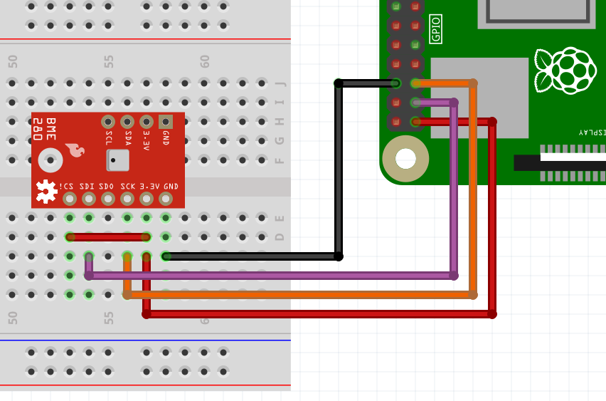
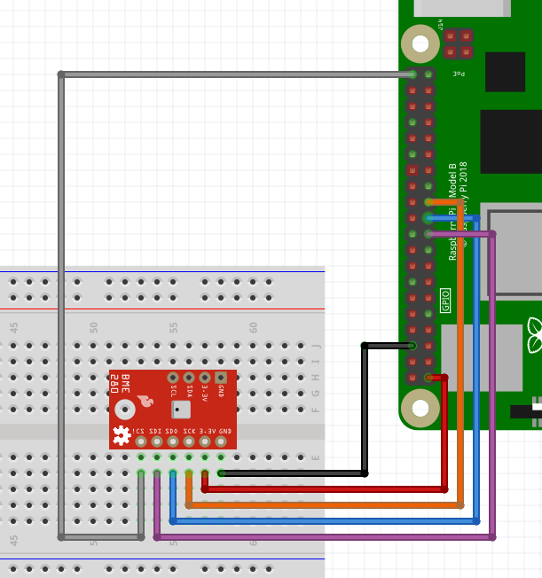

Pi4J V2 :: Java I/O Library for Raspberry Pi :: JBang example code
==================================================================

[](https://join.slack.com/t/pi4j/shared_invite/zt-1ttqt8wgj-E6t69qaLrNuCMPLiYnBCsg)
[](https://pi4j.com)
[](https://twitter.com/pi4j)

This project contains several example applications that you can run as single files with JBang, using the Pi4J (V2) as demonstrated on Voxxed Days Brussels on May 23th 2023.

[](https://youtu.be/w4AR4hWP3Qk)

More info is available on [pi4j.com: "Running Pi4J with JBang"](https://pi4j.com/documentation/building/jbang/).

## PREREQUISITES

* A Raspberry Pi with recent Raspberry Pi OS.
* Install JBang as described on [jbang.dev/download](https://www.jbang.dev/download/). JBang will install Java if it's not installed yet.
```shell
# Install JBang
$ curl -Ls https://sh.jbang.dev | bash -s - app setup

# Check JBang by requesting its version
$ jbang --version        
0.109.0
```
* OPTIONAL: Use [Visual Studio Code](https://code.visualstudio.com/), the free IDE.
```shell
# Install Visual Studio Code
$ sudo apt install code
```
* OPTIONAL: Install the following extensions in Visual Studio Code:
  * [Language Support for Java(TM) by Red Hat](https://marketplace.visualstudio.com/items?itemName=redhat.java)
  * [JBang](https://marketplace.visualstudio.com/items?itemName=jbangdev.jbang-vscode)

## SCRIPTS IN THIS PROJECT

This project contains several examples to demonstrate both JBang and Pi4J. Each java-file is a full-containing runnable JBang application. This means you don't need Maven, Gradle, or other Java build tool.

To tell JBang that it must handle the file as a Java application and do some upfront preparation work, the first line in each file is: `///usr/bin/env jbang "$0" "$@" ; exit $?`.

When an application needs dependencies, they are defined inside the file itself in a line starting with `//DEPS`. For instance, to use the Pi4J Core library: `//DEPS com.pi4j:pi4j-core:2.3.0`.

* `HelloWorld.java`: Basic Java example.
* `JsonParsing.java`: Shows how to use dependencies, can be executed on any computer.
* `Pi4JMinimalExample.java`: Basic example with Pi4J and a LED (DigitalOutput) and button (DigitalInput).
* `Pi4JTempHumPressI2C.java`: Reading temperature, humidity and pressure from a BME280 sensor via I2C.
* `Pi4JTempHumPressSpi.java`: Reading temperature, humidity and pressure from a BME280 sensor via SPI.
* `PixelblazeOutputExpander.java`: Controlling LED strips via serial commands to the Pixelblaze Output Expander.
* `PixelblazeOutputExpanderImageMatrix.java`: Similar to `PixelblazeOutputExpander.java` to output 8*32 images onto an RGB LED matrix.

### GET FROM GITHUB

You can clone this project to your Raspberry Pi in the terminal with the following commands:

```bash
$ git clone https://github.com/Pi4J/pi4j-jbang
$ cd pi4j-jbang
```

### EXAMPLE USAGE

Check the **description of each example in the file itself** for more information! These are only a few examples:

```bash
// Execute HelloWorld 
$ jbang HelloWorld.java
[jbang] Building jar...
Hello World

// Execute JsonParsing that needs fasterxml libraries 
$ jbang JsonParsing.java 
[jbang] Resolving dependencies...
[jbang]    com.fasterxml.jackson.core:jackson-annotations:2.14.1
[jbang]    com.fasterxml.jackson.core:jackson-core:2.14.1
[jbang]    com.fasterxml.jackson.core:jackson-databind:2.14.1
[jbang] Dependencies resolved
[jbang] Building jar...
Data loaded from JSON:

Log message at 2023-02-08T14:39:44.342Z[UTC]
        Severity: Informative message
        Message: Program started
Log message at 2023-02-08T14:39:45.921Z[UTC]
        Severity: Warning message
        Message: File X not found
Log message at 2023-02-08T14:39:46.357Z[UTC]
        Severity: Error message
        Message: Error at line Y
        
// Execute Pi4JMinimalExample that needs the Pi4J and SLF4J libraries. 
// This example must be executed with sudo as described in the file itself.
$ sudo `which jbang` Pi4JMinimalExample.java
[jbang] Building jar...
[main] INFO com.pi4j.Pi4J - New auto context
[main] INFO com.pi4j.Pi4J - New context builder
[main] INFO com.pi4j.platform.impl.DefaultRuntimePlatforms - adding platform to managed platform map [id=raspberrypi; name=RaspberryPi Platform; priority=5; class=com.pi4j.plugin.raspberrypi.platform.RaspberryPiPlatform]
[main] INFO com.pi4j.util.Console - LED high
[main] INFO com.pi4j.util.Console - LED low
```

## WIRING

The Pi4J examples in this project, require electronic components attached to the Raspberry Pi. In the code, you can find more information about the connections and here the wiring schemes are provided.

### Pi4JMinimalExample.java

TODO

### Pi4JPixelBlazeOutputExpander.java

TODO

### Pi4JTempHumPressI2C.java



### Pi4JTempHumPressSpi.java



## LICENSE

Pi4J Version 2.0 and later is licensed under the Apache License,
Version 2.0 (the "License"); you may not use this file except in
compliance with the License.  You may obtain a copy of the License at:
http://www.apache.org/licenses/LICENSE-2.0

Unless required by applicable law or agreed to in writing, software
distributed under the License is distributed on an "AS IS" BASIS,
WITHOUT WARRANTIES OR CONDITIONS OF ANY KIND, either express or implied.
See the License for the specific language governing permissions and
limitations under the License.

